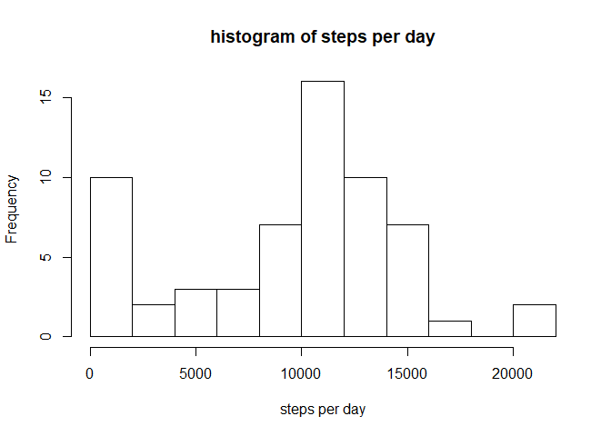
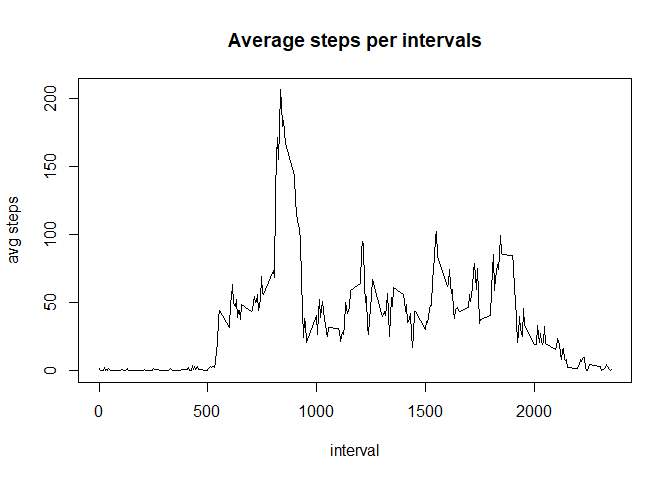
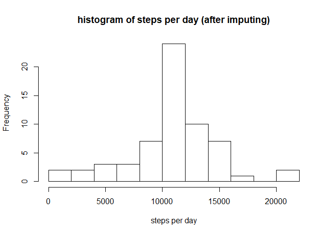
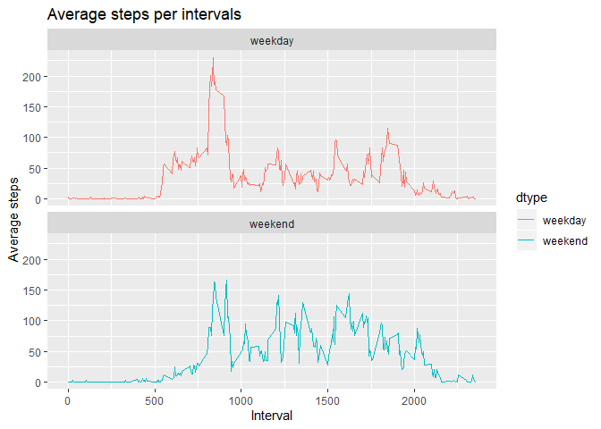

## Loading and preprocessing the data

```r
library(tidyverse)
library(magrittr)
```


```r
df <- read.csv('activity.csv')
df$date <- as.Date(df$date, "%Y-%m-%d")
```


## What is mean total number of steps taken per day?

```r
daily <- df %>%
   group_by(date) %>%
   summarise(step_day=sum(steps, na.rm=T)) %>%
   ungroup()

hist(daily$step_day, xlab='steps per day', main='histogram of steps per day', breaks=10)
```

<!-- -->

```r
print(paste('mean of steps per day : ', mean(daily$step_day)))
```

```
## [1] "mean of steps per day :  9354.22950819672"
```

```r
print(paste('median of steps per day : ', median(daily$step_day)))
```

```
## [1] "median of steps per day :  10395"
```

## What is the average daily activity pattern?

```r
interval_avg <- df %>%
   group_by(interval) %>%
   summarise(avg_step=mean(steps, na.rm=T)) %>%
   ungroup() %>%
   arrange(interval)
with(interval_avg, plot(interval, avg_step, typ='l', xlab='interval', ylab='avg steps',
                main="Average steps per intervals"))
```

<!-- -->
  
- Which 5-minute interval, on average across all the days in the dataset, contains the maximum number of steps?

```r
interval_avg$interval[which.max(interval_avg$avg_step)]
```

```
## [1] 835
```

## Imputing missing values
We will use avg steps for each interval to impute missing values.

```r
df_imp <- df %>%
   left_join(interval_avg, by='interval') %>%
   mutate(steps=ifelse(is.na(steps), avg_step, steps)) %>%
   select(-c('avg_step'))

daily_imp <- df_imp %>%
   group_by(date) %>%
   summarise(step_day=sum(steps)) %>%
   ungroup()

hist(daily_imp$step_day, xlab='steps per day', main='histogram of steps per day (after imputing)', breaks=10)
```

<!-- -->

```r
print(paste('mean of steps per day : ', mean(daily_imp$step_day)))
```

```
## [1] "mean of steps per day :  10766.1886792453"
```

```r
print(paste('median of steps per day : ', median(daily_imp$step_day)))
```

```
## [1] "median of steps per day :  10766.1886792453"
```

## Are there differences in activity patterns between weekdays and weekends?

```r
wdf <- df_imp %>%
   mutate(dtype=weekdays(date)) %>%
   mutate(dtype=ifelse((dtype=='星期日'|dtype=='星期六'), 'weekend', 'weekday')) %>%
   group_by(interval, dtype) %>%
   summarise(avg_step=mean(steps, na.rm=T)) %>%
   ungroup()

plot<- ggplot(wdf, aes(x=interval, y=avg_step, color=dtype)) +
       geom_line() +
       labs(title="Average steps per intervals", x ="Interval", y = "Average steps") +
       facet_wrap(~dtype, ncol = 1, nrow=2)
print(plot)
```

<!-- -->
